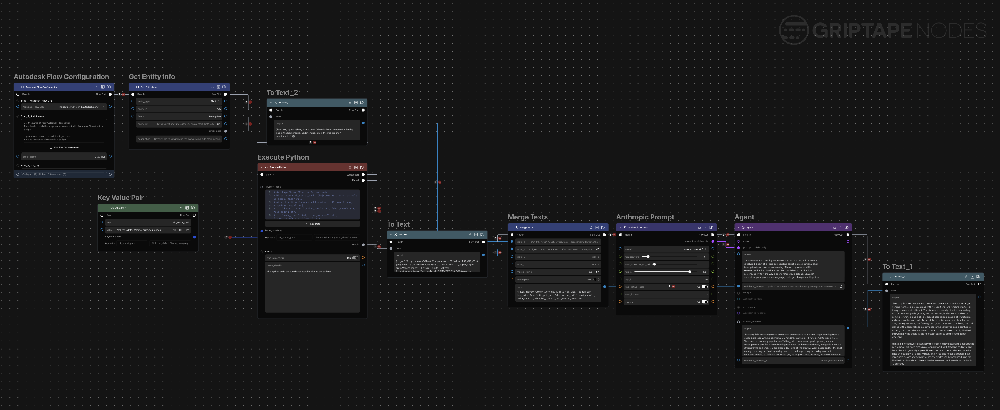

# Griptape Comp Progress Reporter (WORK IN PROGRESS)

A Quick WORK IN PROGRESS Griptape Nodes experiment that auto-generates shot progress reports from Nuke comps and publishes them to ShotGrid (Flow Production Tracking).

## What it does

When an artist runs the workflow from inside Nuke, a Python node parses the open `.nk` script as plain text — no Nuke dependency — and builds a compact digest of the shot: shot code, frame range, format, source plates, Write/output status, node operation histogram, and disabled/WIP counts. Serialized blobs (roto, tracker curves) are skipped so the summary stays small and signal-rich.

That digest is passed to an Agent node running Claude, which writes a concise progress note in plain production language. The artist reviews and edits the text before anything is sent. The note is then published to ShotGrid as a Progress Report entity linked to the shot's comp Task.

## Files

- `digest.py` — Griptape "Execute Python" node. Parses a `.nk` file and returns a structured dict (`digest`, `shot_code`, `node_count`, `write_path_set`, etc.)
- `prompt.md` — System prompt for the Claude agent node. Instructs it to write a three-part progress note: current state, remaining work, and an estimated completion percentage.
- `overview.md` — Full workflow description.
- `test_results/` — Sample digests and screenshot from development runs.

## Requirements

- [Griptape Nodes](https://github.com/griptape-ai/griptape-nodes)
- An Anthropic API key configured as a Prompt config in Griptape Nodes
- ShotGrid / Flow Production Tracking credentials (for the publish step)

The digest parser (`digest.py`) has no external dependencies and runs on any Python 3 environment.
